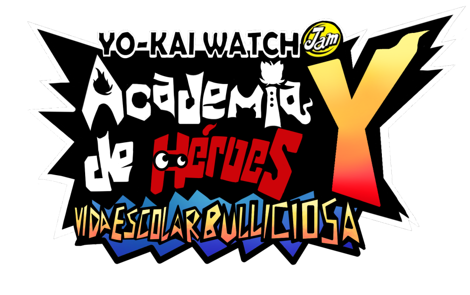
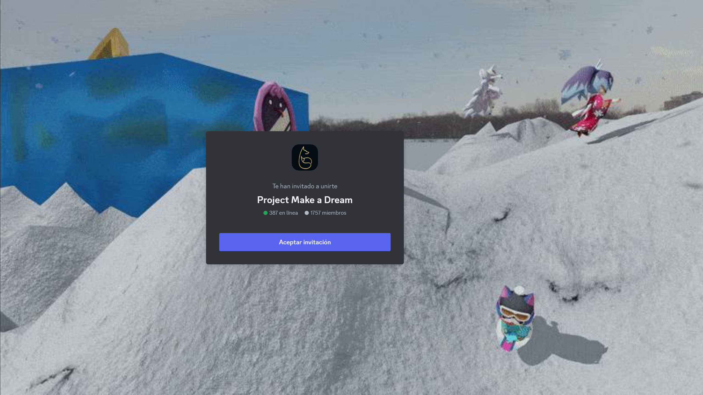

    

# Yo-Kai Watch Jam Traduccion al español
Juego está siendo traducido de manera manual y también desde una versión inglesa.
# Importante
**Es necesaria la actualización 4.0.0 del juego para que todo funcione sin errores.**
# Instalación
Descarga la última versión desde [***releases***](https://github.com/agente-177/Yo-kai-Watch-Jam-Traduccion-Espanol/releases)

### Ryujinx:
En el directorio de datos de Ryujinx:
 - `/home/{USERNAME}/.config/Ryujinx/` en **Linux**.
 - `C:\users\{USERNAME}\AppData\Roaming\Ryujinx` en **Windows**.

Lo más probable es que la carpeta donde se necesiten poner los datos sea en `{...Ryujinx}/mods/contents/010051d010fc2000/`

### Switch
Para atmosphere: `Atmosphere/contents/010051d010fc2000`

Para SXOS: `SXOS/titles/010051d010fc2000`

# Creditos
- Y School Heroes: Bustlin' School Life. English Translation Mod Team (check [gbatemp.net page](https://gamebanana.com/mods/480082) - Base del juego en inglés.
- Su servidor de Discord es: https://discord.gg/2SzR528q

# PROJECT MAKE A DREAM
Make a Dream es un servidor de discord en el que están varias de las traducciones de los juegos de Yo-kai watch al español, mangas, y fan-games hechos por la comunidad.
Cualquier duda en el servidor, siempre contestamos.

> [Discord](https://discord.gg/project-make-a-dream-846980324034347008)

